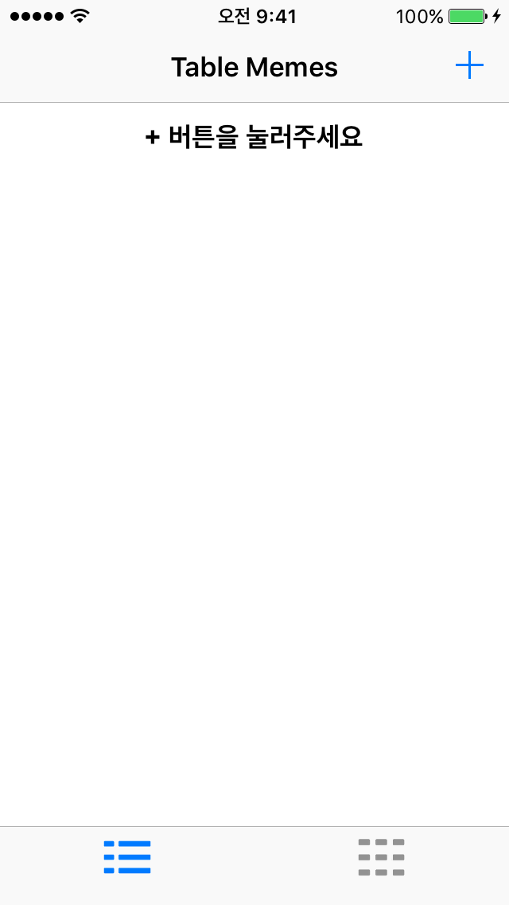
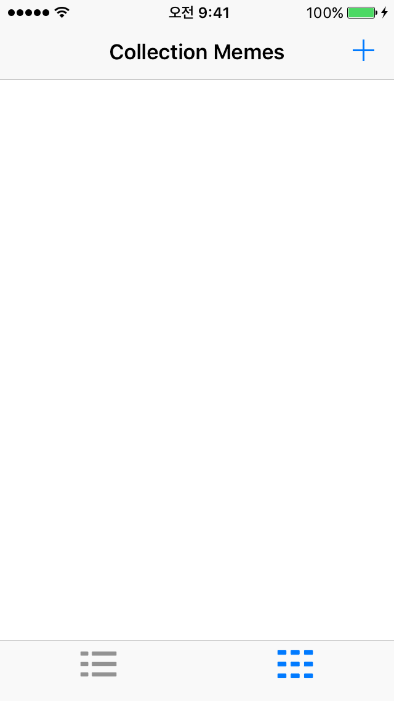
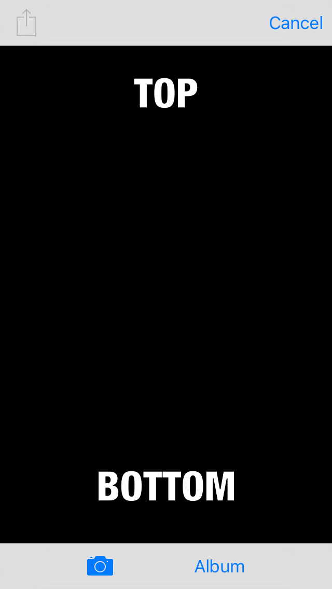
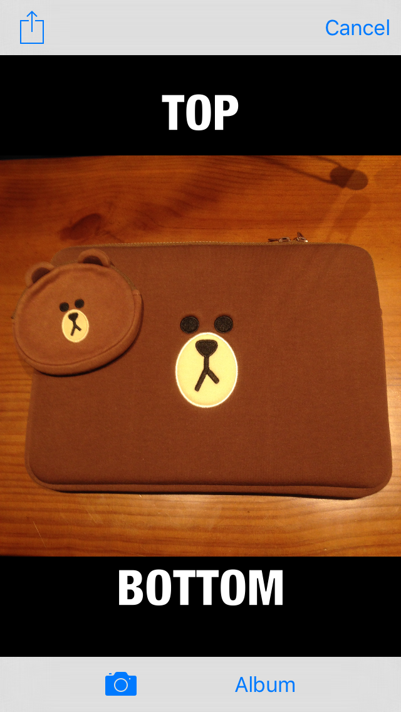
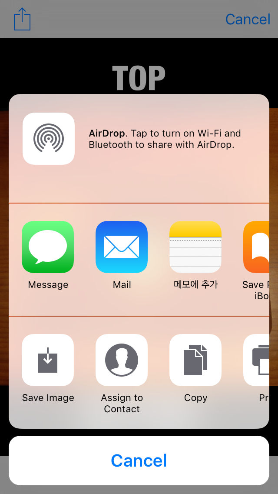
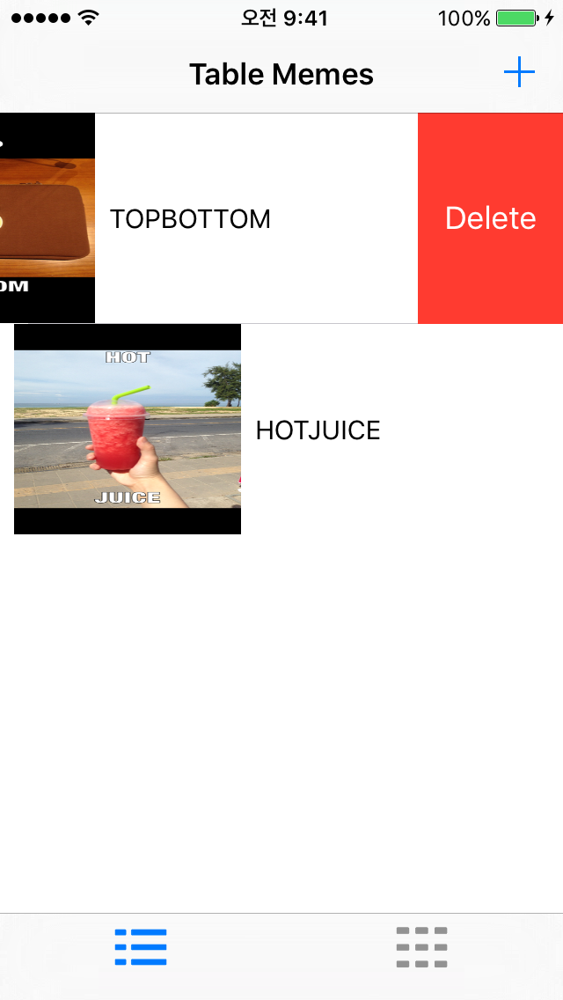
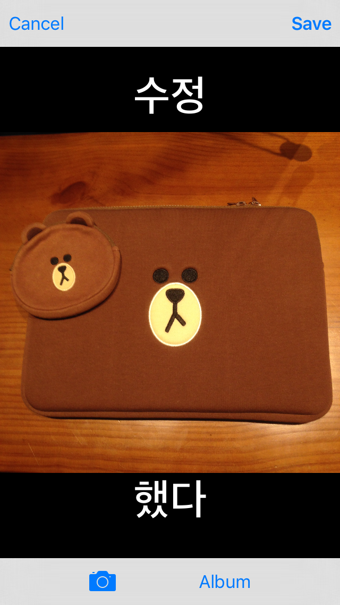
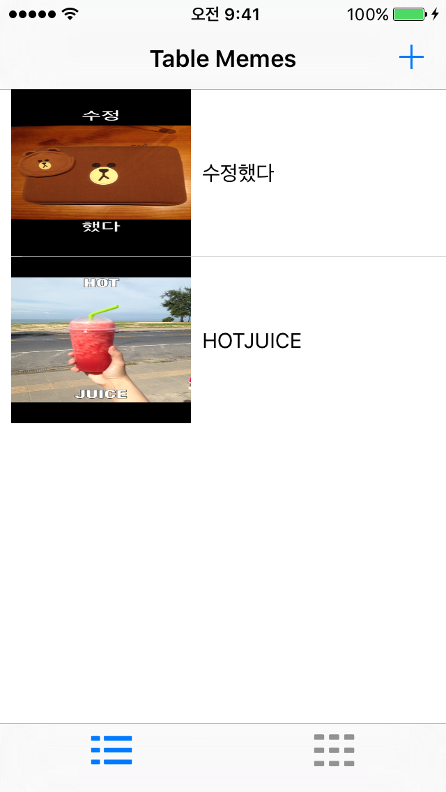

# LimboMemeMe-iamqjin
MemeMe App은 Udacity의 "UIKit Fundamentals" 강좌를 들으면서 작성한 앱입니다.

## 1.Meme App 개요
Meme App은 촬영한 이미지나 앨범에 있는 이미지를 이용하여 그 위에 새로운 텍스트를 적용하여 위트있는 이미지를 생성하는 App입니다.

 

## 2. Meme App 기본 화면

###* 앱 스플래시

 

###* 테이블 화면

테이블 뷰가 첫 화면으로 상단의 + 버튼으로 이미지를 추가할 수 있습니다.

 

###* 콜렉션 화면

콜렉션 뷰는 하단에 있는 탭바를 이용하여 화면 전환을 할 수 있으며 이 화면에서도 또한 상단 + 버튼을 통해 이미지를 추가할 수 있습니다.

 

###* 이미지 선택 화면

1.검정 화면으로 시작됩니다.
1.하단의 카메라 혹은 앨범을 눌러 사진을 선택합니다.
1.선택했을 시 상단 왼쪽에 공유버튼이 활성화 됩니다.
1.공유버튼을 눌렀을 시 여러가지 옵션에 따라 작동하게 됩니다.

###* 이미지 삭제 화면

이미지를 선택 후 왼쪽으로 스와이프 했을시 삭제버튼이 활성화 됩니다.

 

###* 이미지 수정 화면

테이블 셀을 직접 선택하게 되면 이미지 편집창이 나타납니다.
사진을 바꾸거나 텍스트를 선택하여서 바꾼 뒤 오른쪽 상단 Save 버튼을 누르면 수정이 완료됩니다.

 

## 3. 작동 영상

작동 영상은 유튜브에서 보실 수 있습니다.
https://youtu.be/Oe8-5HTMCEE

## 4. 나만의 kick
* 강의를 통해서 만든 앱의 결과물이 애매한 부분이 많아서 그 부분을 고쳐보려고 노력을 하였습니다. 기본적으로 삭제기능과 수정기능이 있었으면 하여 만들어 보았고 틈틈이 어떠한 작동이 이루어졌는지 알려주는 것이 UI적으로 인지하기 좋을 것 같아 중간중간 메세지를 날려보았습니다.

1. 미미 이미지 삭제기능
1. 미미 이미지 수정기능(텍스트나 이미지를 변경할 수 있다)
1. UI적 도움요소들
